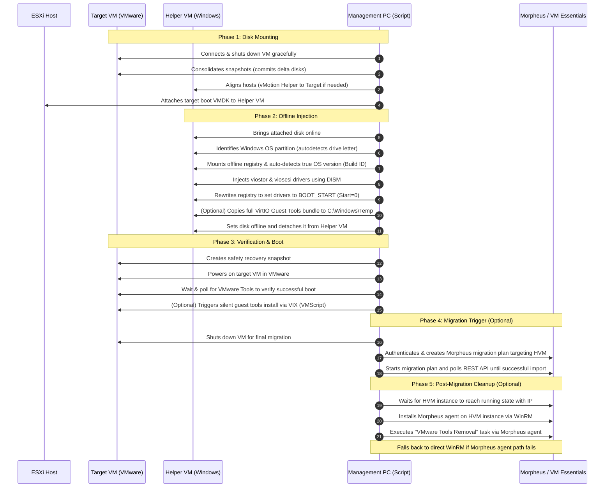

# VMware Windows VM Migration to VME (`Invoke-VMwareWindowsMigrationToVME.ps1`)

An automated PowerShell script that migrates Windows VMs from VMware to **HPE Morpheus VM Essentials (HVM)**. It handles the complete migration lifecycle: offline VirtIO driver injection, pre-migration preparation (WinRM, RDP), Morpheus migration plan execution, and post-migration cleanup (Morpheus agent installation, VMware Tools removal).

Historically, migrating Windows VMs from VMware to KVM platforms results in a **INACCESSIBLE_BOOT_DEVICE** Blue Screen (BSOD) because the target VM lacks VirtIO controllers. This script solves that problem cleanly and automatically.

---

## ⚠️ Disclaimer & Important Warnings

> **Read this before running the script.**

This script makes **irreversible changes** to the source VM. By using it you accept full responsibility for the outcome. The author(s) accept **no liability** for data loss, downtime, corruption, or any other damage — direct or indirect — resulting from use of this script. Use entirely at your own risk.

### What the script does to your source VM

| Action | Impact |
| :--- | :--- |
| Shuts down the source VM | VM is powered off before disk operations begin |
| **Permanently merges all existing snapshots** | All snapshot delta disks are committed into the base VMDK. **This cannot be undone.** The script will list existing snapshots and prompt for confirmation before proceeding. |
| Modifies the offline system disk | VirtIO drivers are injected and the boot registry is edited directly on the VMDK |
| Migrates the VM into HPE VM Essentials | The source VM is imported into the HVM platform |

### Before you run

- ✅ **Take a full backup or clone the VM** in vSphere before running. A cold clone (full copy) is recommended — not a snapshot, as all snapshots will be merged.
- ✅ **Test in a lab or non-production environment first.** Do not run against production workloads until you have validated the process end-to-end in a safe environment.
- ✅ Ensure you have the vCenter permissions and Morpheus API access required.
- ✅ Review the parameter reference below and verify all values before executing.

> **This script is provided "as is", without warranty of any kind.** The creator(s) make no representations or warranties regarding fitness for any purpose. You are solely responsible for validating that the script is appropriate for your environment and for any consequences of its use.

---

## Compatibility

The table below reflects real-world test results. Untested versions are expected to work (all supported VirtIO driver folders are present) but have not been verified end-to-end. Update this table as you complete test migrations.

| Windows Version | Migration Status | Notes |
| :--- | :---: | :--- |
| Windows Server 2025 | ✅ Tested | Full end-to-end migration verified |
| Windows Server 2022 | ⚠️ Untested | Driver folder `2k22` present |
| Windows Server 2019 | ⚠️ Untested | Driver folder `2k19` present |
| Windows Server 2016 | ⚠️ Untested | Driver folder `2k16` present |
| Windows Server 2012 R2 | ⚠️ Untested | Driver folder `2k12R2` present |
| Windows 11 | ⚠️ Untested | Driver folder `w11` present |
| Windows 10 | ⚠️ Untested | Driver folder `w10` present |

---

## How It Works

Instead of running agents inside every live target VM or relying on manual registry hacking, this script utilizes a secure **Helper VM loop-back mount** technique.



---

## Key Features

- **Automated Host Alignment**: If the Target VM and the Helper VM are on different ESXi hosts, the script automatically vMotions the Helper VM to the target host to enable VMDK hot-mounting.
- **Accurate OS Build Detection**: Avoids unreliable vCenter guest metadata. It temporarily mounts the target's offline `SOFTWARE` registry hive to query the actual Windows build number, mapping it precisely to the correct VirtIO driver folder (e.g. Server 2025 vs. 2022).
- **Offline Registry Remediation**: Sets driver start values directly in the offline control set (`Start=0`), ensuring Windows recognizes the boot devices immediately upon startup.
- **Pure Local Guest-Tools Staging**: By default the script performs a zero-network-hop, local VMDK copy of the guest tools onto the mounted target disk. Once the VM boots, the script executes the installer silently. Use `-DoNotInstallGuestTools` to skip this behaviour.
- **Automatic VMware Tools Removal**: After the VM is successfully migrated to HVM, the script automatically removes VMware Tools from the running HVM instance. It first enables WinRM on the source VM (pre-migration) as the management channel, then post-migration it attempts to install the Morpheus agent (via WinRM) and remove tools via a Morpheus task. If the agent path is unavailable, it falls back to direct `Invoke-Command` over WinRM. Use `-DoNotRemoveVMwareTools` to skip this step entirely.
- **End-to-End Morpheus HVM Integration**: Gracefully shuts down the prepared VM, connects to the Morpheus REST API (supporting standard auth or secure bearer tokens), creates a migration plan targeting your HVM Cloud, starts it, and polls until import is complete.
- **Enterprise Safety Nets**: Automatically detects and consolidates target VM snapshots before mounting (required to release file locks on the base disk) and creates a safety rollback snapshot before the first boot test.

---

## Directory Structure & Prerequisites

### 1. Script Host Requirements
- **OS**: Windows Management PC or Jump Box with **PowerShell 7.0 or later** (enforced at startup).
- **Modules**: VCF.PowerCLI module installed:
  ```powershell
  Install-Module VCF.PowerCLI -AllowClobber -SkipPublisherCheck
  ```
  > If you previously installed `VMware.PowerCLI`, uninstall it first (`Uninstall-Module VMware.PowerCLI -AllVersions`) as the two packages conflict. See the [Broadcom PowerCLI Installation Guide](https://developer.broadcom.com/powercli/installation-guide) for details.
- **Privileges**: Administrator on the local execution host, and permissions on vCenter to modify VM settings, run guest scripts, and optionally migrate VMs.

### 2. The Helper VM
- **OS**: Windows Server 2016 or later, hosted on the same vCenter cluster.
- **VMware Tools**: Installed and running.
- **Credentials**: Local Administrator account with administrative rights.
- **Driver Staging Area**: A directory containing the VirtIO driver files, organized in the standard Red Hat/Fedora layout. 

#### Driver Directory Format
Stage the VirtIO drivers on the **Helper VM** (e.g. in `C:\Drivers\virtio-win`) using this layout:
```text
C:\Drivers\virtio-win\
├── viostor\
│   ├── 2k25\amd64\
│   │   ├── viostor.inf
│   │   ├── viostor.sys
│   │   └── viostor.cat
│   ├── 2k22\amd64\
│   └── 2k19\amd64\
├── vioscsi\
│   ├── 2k25\amd64\
│   │   ├── vioscsi.inf
│   │   ├── vioscsi.sys
│   │   └── vioscsi.cat
│   ├── 2k22\amd64\
│   └── 2k19\amd64\
└── virtio-win-guest-tools.exe
```

---

## Detailed Parameter Reference

> **Interactive mode**: Parameters marked *Auto-discover* are optional. When omitted, the script queries vCenter / Morpheus and presents a numbered selection menu so you can pick from available options at runtime. Parameters that cannot be discovered (credentials, server addresses) remain required.

| Parameter | Type | Required | Description |
| :--- | :--- | :---: | :--- |
| `-VCServer` | String | **Yes** | vCenter Server FQDN or IP. |
| `-TargetVMName` | String | Auto-discover | Name of the VMware Windows VM to migrate. Omit to select interactively from all vCenter VMs. |
| `-HelperVMName` | String | Auto-discover | Name of the running helper Windows VM. Omit to select interactively (same-host VMs sorted first). Not needed with `-MigrationOnly`. |
| `-HelperVMUser` | String | **Yes** | Local Admin username on the helper VM. |
| `-HelperVMPassword` | Object | **Yes** | Local Admin password (string, SecureString, or PSCredential). |
| `-VirtIODriverPath` | String | Auto-discover | Path *as seen from the helper VM* to the staged drivers directory. Omit to enter interactively. Not needed with `-MigrationOnly`. |
| `-GuestOSFolder` | String | No | Manually override the auto-detected OS subfolder (Valid: `2k25`, `2k22`, `2k19`, `2k16`, `2k12R2`, `w11`, `w10`). |
| `-SnapshotName` | String | No | Name of the post-injection safety snapshot (Default: `Pre-VirtIO-Injection`). |
| `-ForceHardStopMin` | Int | No | Minutes to wait for graceful target shutdown before forcing power-off (Default: `10`). |
| `-SkipSnapshot` | Switch | No | Skip creating the post-injection safety snapshot. |
| `-DeleteSnapshot` | Switch | No | Delete the safety snapshot after confirmed successful boot. |
| `-DoNotInstallGuestTools` | Switch | No | Skip the VirtIO guest tools copy and silent install. By default the script copies the tools bundle onto the target disk while it is mounted and runs the installer silently after boot. Specify this switch to disable that behaviour. |
| `-TargetVMUser` | String | No | Local administrator on target VM (Required unless `-DoNotInstallGuestTools` and `-DoNotRemoveVMwareTools`). |
| `-TargetVMPassword` | Object | No | Local admin password for target VM (Required unless `-DoNotInstallGuestTools` and `-DoNotRemoveVMwareTools`). |
| `-DoNotRemoveVMwareTools` | Switch | No | Skip the automatic post-migration VMware Tools removal. By default, when `-TriggerMorpheusMigration` is set, the script enables WinRM on the source VM pre-migration, then after successful migration it removes VMware Tools from the HVM instance via the Morpheus agent (with WinRM direct fallback). Requires `-TargetVMUser` / `-TargetVMPassword`. |
| `-DoNotEnableRDP` | Switch | No | Skip the automatic Remote Desktop enablement pre-migration. By default, the script enables RDP on the target VM via a VMware guest script before migration so the HVM instance is immediately accessible via Remote Desktop after cutover. |
| `-TriggerMorpheusMigration` | Switch | No | Shuts down target VM after successful boot verify, then automates Morpheus HVM import. |
| `-MorpheusServer` | String | No | FQDN or IP of the Morpheus / VM Essentials instance (no `https://`). |
| `-MorpheusToken` | SecureString | No | Morpheus API bearer token. Pass as `(ConvertTo-SecureString "token" -AsPlainText -Force)` or from a secrets vault. |
| `-MorpheusUser` | String | No | Morpheus username (used to fetch token if token parameter is absent). |
| `-MorpheusPassword` | String | No | Morpheus password (used to fetch token if token parameter is absent). |
| `-MorpheusTargetCloudId` | String | Auto-discover | Target HVM Cloud ID in Morpheus. Omit to select interactively from available clouds. |
| `-MorpheusTargetPoolId` | String | Auto-discover | Target resource pool ID in Morpheus. Omit to select interactively (auto-selects if only one exists). |
| `-MorpheusTargetNetworkId` | String | Auto-discover | Target Network ID in Morpheus. Omit to select interactively from networks in the target cloud. |
| `-MorpheusTargetStoreId` | String | Auto-discover | Target Datastore ID in Morpheus. Omit to select interactively (displays free space). |
| `-MorpheusSkipSSL` | Switch | No | Bypass TLS certificate validation on the Morpheus endpoint (for self-signed certs). |
| `-VCSkipSSL` | Switch | No | Bypass TLS certificate validation for vCenter (for self-signed certs). Defaults to `Fail` if omitted. |
| `-WinRMSkipSSL` | Switch | No | Bypass TLS certificate validation on WinRM sessions to migrated VMs. |
| `-VCUser` | String | No | vCenter username. If omitted, PowerCLI uses ambient SSO credentials. |
| `-VCPassword` | SecureString | No | vCenter password (used with `-VCUser`). |
| `-MorpheusMigrationTimeoutHours` | Int | No | Max hours to wait for migration completion (Default: `4`). |
| `-LogPath` | String | No | Path to write script logs on management host (Default: `C:\Windows\Logs\VirtIO-HelperInject`). |

---

## Usage Examples

### 1. Interactive Mode — Let the Script Discover Everything
Provide only credentials and switches. The script will query vCenter and Morpheus and present numbered menus to select the target VM, helper VM, network, cloud, and datastore.
```powershell
.\Invoke-HelperVMVirtIOInject.ps1 `
  -VCServer vcsa.company.local `
  -HelperVMUser "Administrator" `
  -HelperVMPassword "HelperSecurePass!" `
  -TargetVMUser "Administrator" `
  -TargetVMPassword "TargetPass!" `
  -TriggerMorpheusMigration `
  -MorpheusServer "morpheus.company.local" `
  -MorpheusToken (ConvertTo-SecureString "a50c822e-1ff2-4b2a-8742-1e9a7e02df5b" -AsPlainText -Force) `
  -MorpheusSkipSSL `
  -VCSkipSSL
```

### 2. Basic Offline Injection Only (No Guest Tools)
Prepares the VM `WIN2022-APP` by injecting VirtIO drivers and verifying boot. Guest tools installation is skipped explicitly. Leaves a safety snapshot behind for manual review.
```powershell
.\Invoke-HelperVMVirtIOInject.ps1 `
  -VCServer vcsa.company.local `
  -TargetVMName "WIN2022-APP" `
  -HelperVMName "HELPER-WIN01" `
  -HelperVMUser "Administrator" `
  -HelperVMPassword "HelperSecurePass!" `
  -VirtIODriverPath "C:\Drivers\virtio-win" `
  -DoNotInstallGuestTools
```

### 3. Full Injection with Guest Tools and Snapshot Cleanup
Auto-injects VirtIO drivers and installs all Guest Tools (network drivers, balloon service, etc.) silently upon boot (default behaviour), verifies boot, and deletes the safety snapshot automatically.
```powershell
.\Invoke-HelperVMVirtIOInject.ps1 `
  -VCServer vcsa.company.local `
  -TargetVMName "WIN2025-SQL" `
  -HelperVMName "HELPER-WIN01" `
  -HelperVMUser "Administrator" `
  -HelperVMPassword "HelperSecurePass!" `
  -VirtIODriverPath "C:\Drivers\virtio-win" `
  -TargetVMUser "Administrator" `
  -TargetVMPassword "SqlTargetAdminPass!" `
  -DeleteSnapshot
```

### 4. Fully Automated End-to-End Migration to Morpheus HVM
This will inject the storage drivers offline, install all guest tools on boot, verify the VM boots cleanly, shut it down, trigger the Morpheus migration plan into the target HVM cloud (ID: 5), and poll until completed. Network is specified explicitly; omit it (and cloud/pool/datastore) to select interactively.
```powershell
.\Invoke-HelperVMVirtIOInject.ps1 `
  -VCServer vcsa.company.local `
  -TargetVMName "WIN2019-WEB01" `
  -HelperVMName "HELPER-WIN01" `
  -HelperVMUser "Administrator" `
  -HelperVMPassword "HelperSecurePass!" `
  -VirtIODriverPath "C:\Drivers\virtio-win" `
  -TargetVMUser "Administrator" `
  -TargetVMPassword "TargetWebPass!" `
  -DeleteSnapshot `
  -TriggerMorpheusMigration `
  -MorpheusServer "morpheus.company.local" `
  -MorpheusToken (ConvertTo-SecureString "a50c822e-1ff2-4b2a-8742-1e9a7e02df5b" -AsPlainText -Force) `
  -MorpheusTargetCloudId "5" `
  -MorpheusTargetNetworkId "22" `
  -MorpheusSkipSSL
```

---

## Log Output

Logs are generated both on screen (with rich color coding) and appended to a timestamped file located by default at:
`C:\Windows\Logs\VirtIO-HelperInject\HelperVirtIO_YYYYMMDD_HHMMSS.log`

---

## Licensing & Contributions

For licensing terms, see the [LICENSE](LICENSE.md) file. For advice on extending the script or contributing fixes, see the [CONTRIBUTING](CONTRIBUTING.md) guide. For help debugging execution issues, review the [TROUBLESHOOTING](TROUBLESHOOTING.md) guide.
