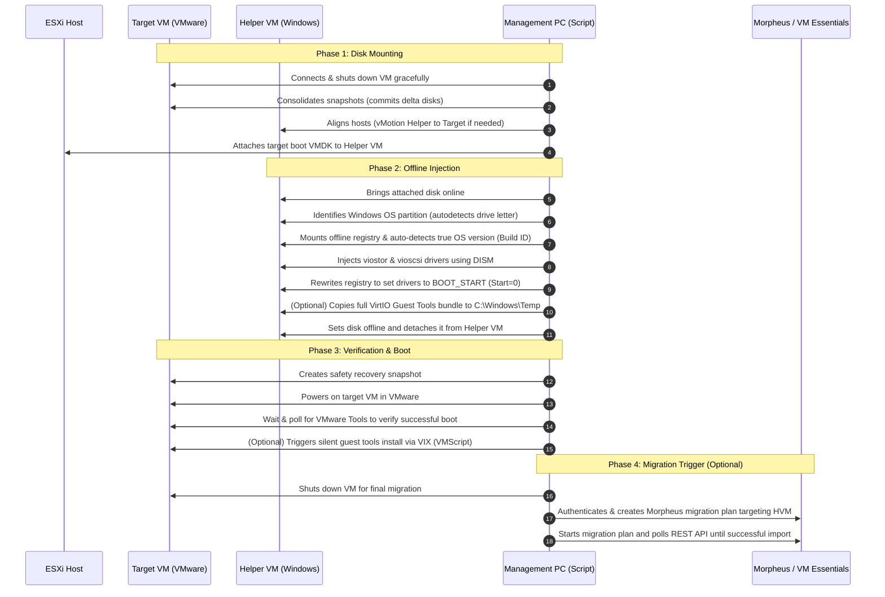

# Pre-Migration VirtIO Driver Injector (`Invoke-HelperVMVirtIOInject.ps1`)

An enterprise-grade, fully automated PowerShell script that prepares offline VMware Windows VMs for migration to KVM-based environments—specifically **HPE Morpheus VM Essentials (HVM)**—by injecting VirtIO storage drivers (`viostor` and `vioscsi`) directly into the VM's offline system disk.

Historically, migrating Windows VMs from VMware to KVM platforms results in a **INACCESSIBLE_BOOT_DEVICE** Blue Screen (BSOD) because the target VM lacks VirtIO controllers. This script solves that problem cleanly and automatically.

---

## How It Works

Instead of running agents inside every live target VM or relying on manual registry hacking, this script utilizes a secure **Helper VM loop-back mount** technique.



---

## Key Features

- **Automated Host Alignment**: If the Target VM and the Helper VM are on different ESXi hosts, the script automatically vMotions the Helper VM to the target host to enable VMDK hot-mounting.
- **Accurate OS Build Detection**: Avoids unreliable vCenter guest metadata. It temporarily mounts the target's offline `SOFTWARE` registry hive to query the actual Windows build number, mapping it precisely to the correct VirtIO driver folder (e.g. Server 2025 vs. 2022).
- **Offline Registry Remediation**: Sets driver start values directly in the offline control set (`Start=0`), ensuring Windows recognizes the boot devices immediately upon startup.
- **Pure Local Guest-Tools Staging**: When `-InstallGuestTools` is specified, the script performs a zero-network-hop, local VMDK copy of the guest tools onto the mounted target disk. Once the VM boots, the script executes the installer silently.
- **End-to-End Morpheus HVM Integration**: Gracefully shuts down the prepared VM, connects to the Morpheus REST API (supporting standard auth or secure bearer tokens), creates a migration plan targeting your HVM Cloud, starts it, and polls until import is complete.
- **Enterprise Safety Nets**: Automatically detects and consolidates target VM snapshots before mounting (required to release file locks on the base disk) and creates a safety rollback snapshot before the first boot test.

---

## Directory Structure & Prerequisites

### 1. Script Host Requirements
- **OS**: Windows Management PC or Jump Box with PowerShell 5.1+.
- **Modules**: VMware PowerCLI module installed (`Install-Module VMware.PowerCLI`).
- **Privileges**: Administrator on the local execution host, and permissions on vCenter to modify VM settings, run guest scripts, and optionally migrate VMs.

### 2. The Helper VM
- **OS**: Windows Server 2016 or later, hosted on the same vCenter cluster.
- **VMware Tools**: Installed and running.
- **Credentials**: Local Administrator account with administrative rights.
- **Driver Staging Area**: A directory containing the VirtIO driver files, organized in the standard Red Hat/Fedora layout. 

#### Driver Directory Format
Stage the VirtIO drivers on the **Helper VM** (e.g. in `C:\Drivers\virtio-win`) using this layout:
```text
C:\Drivers\virtio-win\
├── viostor\
│   ├── 2k25\amd64\
│   │   ├── viostor.inf
│   │   ├── viostor.sys
│   │   └── viostor.cat
│   ├── 2k22\amd64\
│   └── 2k19\amd64\
├── vioscsi\
│   ├── 2k25\amd64\
│   │   ├── vioscsi.inf
│   │   ├── vioscsi.sys
│   │   └── vioscsi.cat
│   ├── 2k22\amd64\
│   └── 2k19\amd64\
└── virtio-win-guest-tools.exe
```

---

## Detailed Parameter Reference

| Parameter | Type | Required | Description |
| :--- | :--- | :---: | :--- |
| `-VCServer` | String | **Yes** | vCenter Server FQDN or IP. |
| `-TargetVMName` | String | **Yes** | Name of the VMware Windows VM to migrate. |
| `-HelperVMName` | String | **Yes** | Name of the running helper Windows VM on the same ESXi host. |
| `-HelperVMUser` | String | **Yes** | Local Admin username on the helper VM. |
| `-HelperVMPassword` | Object | **Yes** | Local Admin password (string, SecureString, or PSCredential). |
| `-VirtIODriverPath` | String | **Yes** | Path *as seen from the helper VM* to the staged drivers directory. |
| `-GuestOSFolder` | String | No | Manually override the auto-detected OS subfolder (Valid: `2k25`, `2k22`, `2k19`, `2k16`, `2k12R2`, `w11`, `w10`). |
| `-SnapshotName` | String | No | Name of the post-injection safety snapshot (Default: `Pre-VirtIO-Injection`). |
| `-ForceHardStopMin` | Int | No | Minutes to wait for graceful target shutdown before forcing power-off (Default: `10`). |
| `-SkipSnapshot` | Switch | No | Skip creating the post-injection safety snapshot. |
| `-DeleteSnapshot` | Switch | No | Delete the safety snapshot after confirmed successful boot. |
| `-InstallGuestTools` | Switch | No | Copier and installer trigger for VirtIO guest tools on target VM. Requires `-TargetVMUser` / `-TargetVMPassword`. |
| `-TargetVMUser` | String | No | Local administrator on target VM (Required for `-InstallGuestTools`). |
| `-TargetVMPassword` | Object | No | Local admin password for target VM (Required for `-InstallGuestTools`). |
| `-TriggerMorpheusMigration` | Switch | No | Shuts down target VM after successful boot verify, then automates Morpheus HVM import. |
| `-MorpheusServer` | String | No | FQDN or IP of the Morpheus / VM Essentials instance (no `https://`). |
| `-MorpheusToken` | String | No | Morpheus API bearer token. |
| `-MorpheusUser` | String | No | Morpheus username (used to fetch token if token parameter is absent). |
| `-MorpheusPassword` | String | No | Morpheus password (used to fetch token if token parameter is absent). |
| `-MorpheusTargetCloudId`| String | No | Target HVM Cloud ID in Morpheus. |
| `-MorpheusTargetNetworkId`| String | No | (Optional) Target Network ID in Morpheus. |
| `-MorpheusTargetStoreId`| String | No | (Optional) Target Storage/Datastore ID in Morpheus. |
| `-MorpheusSkipSSL` | Switch | No | Bypass self-signed SSL validation on the Morpheus endpoint. |
| `-MorpheusMigrationTimeoutHours` | Int | No | Max hours to wait for migration completion (Default: `4`). |
| `-LogPath` | String | No | Path to write script logs on management host (Default: `C:\Windows\Logs\VirtIO-HelperInject`). |

---

## Usage Examples

### 1. Basic Offline Injection & Registry Prep
Prepares the VM `WIN2022-APP` by injecting drivers and verifying boot. Leaves a safety snapshot behind for manual review.
```powershell
.\Invoke-HelperVMVirtIOInject.ps1 `
  -VCServer vcsa.company.local `
  -TargetVMName "WIN2022-APP" `
  -HelperVMName "HELPER-WIN01" `
  -HelperVMUser "Administrator" `
  -HelperVMPassword "HelperSecurePass!" `
  -VirtIODriverPath "C:\Drivers\virtio-win"
```

### 2. Full Injection, Silently Installing Guest Tools, and Snapshot Cleanup
Auto-injects VirtIO, installs all Guest Tools (network drivers, balloon service, etc.) silently upon boot, verifies boot, and deletes the safety snapshot automatically.
```powershell
.\Invoke-HelperVMVirtIOInject.ps1 `
  -VCServer vcsa.company.local `
  -TargetVMName "WIN2025-SQL" `
  -HelperVMName "HELPER-WIN01" `
  -HelperVMUser "Administrator" `
  -HelperVMPassword "HelperSecurePass!" `
  -VirtIODriverPath "C:\Drivers\virtio-win" `
  -InstallGuestTools `
  -TargetVMUser "Administrator" `
  -TargetVMPassword "SqlTargetAdminPass!" `
  -DeleteSnapshot
```

### 3. Fully Automated End-to-End Migration to Morpheus HVM
This will inject the storage drivers offline, install all guest tools on boot, verify the VM boots cleanly, shut it down, trigger the Morpheus migration plan into the target HVM cloud (ID: 5), and poll until completed.
```powershell
.\Invoke-HelperVMVirtIOInject.ps1 `
  -VCServer vcsa.company.local `
  -TargetVMName "WIN2019-WEB01" `
  -HelperVMName "HELPER-WIN01" `
  -HelperVMUser "Administrator" `
  -HelperVMPassword "HelperSecurePass!" `
  -VirtIODriverPath "C:\Drivers\virtio-win" `
  -InstallGuestTools `
  -TargetVMUser "Administrator" `
  -TargetVMPassword "TargetWebPass!" `
  -DeleteSnapshot `
  -TriggerMorpheusMigration `
  -MorpheusServer "morpheus.company.local" `
  -MorpheusToken "a50c822e-1ff2-4b2a-8742-1e9a7e02df5b" `
  -MorpheusTargetCloudId "5" `
  -MorpheusSkipSSL
```

---

## Log Output

Logs are generated both on screen (with rich color coding) and appended to a timestamped file located by default at:
`C:\Windows\Logs\VirtIO-HelperInject\HelperVirtIO_YYYYMMDD_HHMMSS.log`

---

## Licensing & Contributions

For licensing terms, see the [LICENSE](LICENSE.md) file. For advice on extending the script or contributing fixes, see the [CONTRIBUTING](CONTRIBUTING.md) guide. For help debugging execution issues, review the [TROUBLESHOOTING](TROUBLESHOOTING.md) guide.
